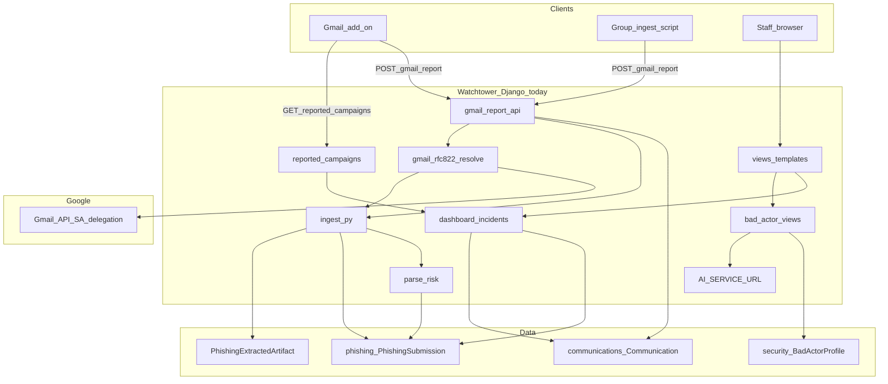
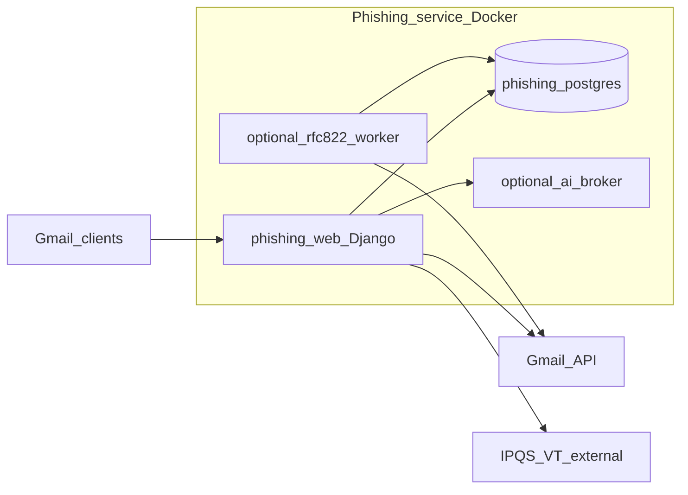

# Architecture

## High-level diagram

## Target standalone topology

## Component responsibilities

| Component | Module(s) | Responsibility |
|-----------|-----------|----------------|
| Gmail report API | `phishing/gmail_report_api.py` | CSRF-exempt JSON APIs for add-on; API client auth |
| Ingest (stub) | `phishing/ingest.py` `ingest_gmail_message_id_report` | Minimal row + gmail internal id artifact |
| Ingest (full) | `phishing/ingest.py` `ingest_phishing_submission` | Parse webhook payload, risk score, artifacts, metadata slim |
| RFC822 resolve | `phishing/gmail_rfc822_resolve.py`, `gmail_service.py` | Fetch MIME, forward/original layers, re-ingest |
| Parse / risk | `phishing/parse.py`, `risk.py`, `unicode_scan.py` | Structured `parsed_email`, flags, fingerprints |
| Clustering | `phishing/cluster_utils.py` | Subject similarity groups (cap 4000 parents) |
| Campaign cards | `phishing/incident_card_groups.py` | Merge clusters by RFC822/origin+subject; analyst fields |
| Dashboard | `phishing/dashboard.py`, `incidents.py`, `list_filters.py` | Context for `/phishing/` and home section |
| Reported campaigns | `phishing/reported_campaigns.py`, `reported_campaign_fingerprints.py` | Add-on fingerprint list |
| Analysis export | `phishing/report_analysis_summary.py` | Duplicate-report analysis for add-on |
| Staff UI | `phishing/views.py`, `bad_actor_views.py` | HTML + JSON for review |
| Mail assembly | `phishing/mail_assembly.py`, `content_analysis.py` | Detail page rows (URLs, emails) |
| Threat assessment | `phishing/threat_assessment.py` | Unified/heuristic/Gemini display scores |
| Cluster automation | `phishing/cluster_auto_pipeline.py` | Auto scans + Gemini when cluster size ≥ 2 (legacy webhook path) |
| Management | `phishing/management/commands/` | Backfill RFC822, parsed email |

## Request lifetimes

### 1. Add-on report (created)

1. POST `/api/phishing/gmail-report/` with `messageId`, `reporter`.
2. Create `Communication` (`com_type=webhook`, `webhook_origin=Gmail_Phishing_MessageId_Report`, empty body).
3. `PhishingSubmission` + artifact (`gmail_internal`).
4. If SA configured: `defer_rfc822_message_id_resolve` in background thread on web worker.
5. Response `status: created`.

### 2. Add-on report (duplicate)

Same `metadata.gmail_message_id` → no new row; return `status: duplicate` + `analysis` from `summarize_phishing_report_analysis` (may pull richer peer by message id).

### 3. Group ingest report

Same API with `reportSource: phishing_group`, `gmailMailbox`, `reportedAsForward: true`. Resolve **must** fetch using ingest mailbox (message id only exists there).

### 4. Analyst opens `/phishing/incidents/<id>/`

Load Communication + PhishingSubmission; assemble review context; optional scans via POST to bad-actor endpoints; verdict POST persists on `PhishingSubmission`.

### 5. Add-on homepage / open message

GET campaigns (hours window) → local match in Apps Script → label thread → show verdict section.

## Webhook origins (phishing-related)

| Origin constant | Meaning |
|-----------------|--------|
| `Gmail_Phishing_MessageId_Report` | Primary add-on / group id-only ingest (`phishing/ingest.py`) |
| Contains `phishing` (legacy) | Full-body email webhook via `watchtower/views.py` → `ingest_phishing_submission` |

Dashboard querysets filter `com_type=webhook`, `parent_communication__isnull=True`, `webhook_origin__icontains=phishing`.

## Clustering constants (dashboard)

From `phishing/cluster_utils.py` and `phishing/list_filters.py`:

| Setting | Value | Notes |
|---------|-------|-------|
| `PHISHING_MAIL_CLUSTER_SOURCE_CAP` | 4000 | Max parent rows considered for clustering |
| `PHISHING_SUBJECT_CLUSTER_MIN_RATIO` | 0.9 | Similarity threshold |
| `PHISHING_SUBJECT_GROUP_MAX_SPAN_HOURS` | 24 | Time window for subject groups |
| `PHISHING_LIST_DEFAULT_DAYS` | 3 | Dashboard date filter default |
| `PHISHING_LIST_PAGE_SIZE` | 50 | Paginated campaign cards |
| `PHISHING_INCIDENT_ELEVATED_SCORE` | 50 | Auto incident threshold |
| Latest incident scan cap | 100 | Header panel clustering |

## Background work

| Mechanism | Trigger | Work |
|-----------|---------|------|
| `defer_rfc822_message_id_resolve` | After successful gmail-report POST | Thread on **web** process; Gmail fetch + full ingest |
| `defer_phishing_cluster_auto_gemini` | Legacy email webhook when cluster ≥ 2 | Not wired on gmail-report path today |
| Apps Script time-driven | Hourly | Group mailbox unread → POST reports |
| Management command | Ops | `resolve_phishing_gmail_rfc822 --all` backfill |

Standalone recommendation: move RFC822 resolve to **Celery/RQ worker** or dedicated `phishing_worker` container instead of daemon threads on Gunicorn workers.

## Caching

| Key | TTL | Purpose |
|-----|-----|---------|
| `phishing:dashboard:latest_incident_summary` | 60s | Dashboard header latest incident |
| Apps Script ScriptCache | 120s | Campaign list (homepage uses fresh fetch on open message in current script) |

## Security boundaries

- **Add-on APIs**: Service API client token + dashboard rule `phishing_gmail_report_api` (not end-user OAuth to Watchtower).
- **Staff UI**: Django session + `has_phishing_mail_access` (feature/dashboard rules on user profile).
- **Gmail SA**: JSON key file; domain-wide delegation; scopes include `gmail.modify` for fetch (see `phishing/gmail_service.py`).
