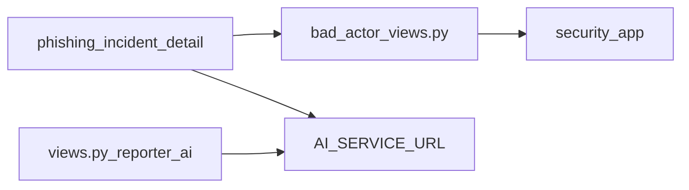

# Threat intel and AI

Phishing incident detail combines **heuristic risk at ingest**, **on-demand third-party scans**, **Bad Actor profile linking**, and **reporter-facing AI guidance** (internal chat + Gemini via broker).

## Architecture

## Bad Actor (`security/` app)

Primary consumer: `phishing/bad_actor_views.py`.

### Models (subset to port)

From `security/models.py`:

- `BadActorProfile`, `BadActorArtifact`, `BadActorCommunicationLink`
- `BadActorIPAddress`
- Artifact type constants: `BAD_ACTOR_ARTIFACT_EMAIL`, `BAD_ACTOR_ARTIFACT_DEFANGED_URL`, etc.

### URL / email analyze endpoints

| Endpoint | Providers | Module |
|----------|-----------|--------|
| `review-emails/analyze/` | IPQualityScore Email Validation | `security/ipqs_email_validation.py` |
| `review-urls/analyze/` | IPQS Malicious URL + VirusTotal | `security/ipqs_malicious_url.py`, `security/virustotal_url_scan.py` |

Scan results persist via `security/bad_actor_url_scans.py`:

- `persist_scan_across_profiles`, `build_scan_log_entry`
- Shared cache across profiles with same lookup key
- `profiles_for_phishing_communication_or_create` ties scans to submission

### Match / associate / create

- **`phishing_bad_actor_match`**: `collect_bad_actor_candidates_for_thread_items` from parsed thread.
- **`associate` / `create`**: CRUD links between submission communication and profiles.

Standalone: replace `communication_id` with `report_id` in link table or rename FK.

### URL screenshots

`phishing/views.py` `phishing_incident_url_screenshot` → `phishing/url_screenshot.py` → `security/apiflash_url_screenshot.py`.

Uses defanged URL refang rules from `security/bad_actor_utils.py`.

### Parse-time coupling

`phishing/parse.py` imports `security.bad_actor_utils` for email/url normalization — keep shared utility module when porting.

### Cluster automation

`phishing/cluster_auto_pipeline.py` and `cluster_alert_email.py` import security scan helpers for batch URL/email scans on clusters (legacy webhook path).

---

## Environment variables (Watchtower `settings.py`)

Set in root **`.env`** / `docker-compose.yml` for `watchtower_web`:

| Variable | Used for |
|----------|----------|
| `IPQUALITYSCORE_API_KEY` | Email validation, malicious URL, IP intel |
| `VIRUSTOTAL_API_KEY` | URL scan engines |
| `APIFLASH_API_KEY` | Live URL screenshots |

Phishing templates surface missing keys in UI when unset (`phishing_incident_detail.html`).

**Standalone `.env`**: copy these three into the new service; do not depend on Watchtower’s env.

---

## AI reporter guidance

### Storage

`PhishingSubmission.reporter_ai_guidance_json` plus:

- `reporter_ai_internal_generated_at`
- `reporter_ai_gemini_generated_at`
- `reporter_ai_last_request_payload`

Logic: `phishing/reporter_ai_store.py`, payload build `phishing/llm_payload.py`.

### Endpoint

POST `/phishing/incidents/<id>/reporter-ai-guidance/run/` → `phishing_reporter_ai_guidance_run` in `bad_actor_views.py`.

Typically runs **internal** model first, then **Gemini** via HTTP broker.

### Django settings (AI broker client)

From `watchtower/settings.py`:

| Setting | Default | Purpose |
|---------|---------|---------|
| `AI_SERVICE_URL` | `http://ai_broker:5000` | Base URL for broker |
| `AI_SERVICE_GEMINI_PATH` | `/api/gemini` | Gemini route |
| `AI_SERVICE_GEMINI_TEMPERATURE` | 0.2 | |
| `AI_SERVICE_GEMINI_MAX_TOKENS` | 4096 | |
| `AI_SERVICE_GEMINI_MODEL` | optional override | |

Compose: `docker-compose.yml` sets `AI_SERVICE_URL` on web container.

### Broker / Gemini secrets

File: `ai_broker/ai_connections.env` (see `ai_broker/ai_connections.env.example`):

| Variable | Purpose |
|----------|---------|
| `GEMINI_API_KEY` | Google Generative Language API |
| `GEMINI_MODEL` | e.g. `gemini-3.8-flash` |
| `GEMINI_503_RETRIES`, `GEMINI_503_RETRY_BASE_SEC` | Retry policy |

Implementation: `ai_broker/gemini_generate.py`.

**Standalone options:**

1. Run **`phishing_ai`** container (copy `ai_broker/`) and set `AI_SERVICE_URL`.
2. Embed Gemini client in Django (duplicate `gemini_generate` logic); set `GEMINI_API_KEY` on web container only.
3. Internal-only reporter AI if district drops Gemini — guard UI when broker unreachable.

### Threat assessment display

`phishing/threat_assessment.py` merges heuristic score, stored AI assessments, analyst verdict for meters and copy.

### Cluster Gemini (optional)

`phishing/cluster_auto_pipeline.py` may call Gemini for cluster summaries when legacy ingest expands clusters — not on gmail-report path today.

---

## Code map (quick reference)

| Concern | Path |
|---------|------|
| Phishing intel HTTP | `phishing/bad_actor_views.py` |
| Detail context keys | `phishing/views.py` (IPQS/VT configured flags) |
| Mail row assembly + scan cache | `phishing/mail_assembly.py` |
| IPQS email | `security/ipqs_email_validation.py` |
| IPQS URL | `security/ipqs_malicious_url.py` |
| VirusTotal | `security/virustotal_url_scan.py` |
| ApiFlash | `security/apiflash_url_screenshot.py` |
| Profile persistence | `security/bad_actor_url_scans.py` |
| AI broker | `ai_broker/` (Flask or similar service) |

---

## Standalone security scope decision

Minimum viable port for feature parity with current `/phishing/` detail:

- All `security/bad_actor_*` modules referenced from phishing
- `security/models.py` Bad Actor tables used by phishing
- IPQS + VT + ApiFlash clients
- Optional: drop unrelated `security/` features (gatekeeper-only models) to reduce scope

Use separate Postgres schema or database; migrate Bad Actor rows linked to phishing communications via `legacy_communication_id`.
